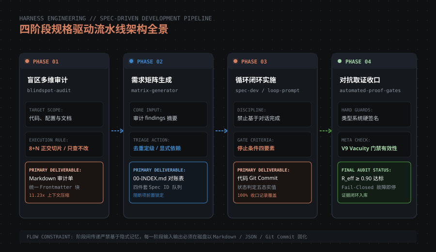

# Open Source Harness Engineering & Fullstack Starter Kit (SSD Suite)

> **让 AI 的全栈交付可被物理验证与信任**：一套基于真实生产检验的**工业级全栈开发底座、品牌工程化系统、设计真理层、实战运维 Runbooks 与 Agent 控制面开源套件**。

[](https://opensource.org/licenses/MIT)
[](#)
[](#)
[](#)
[](#)
[](#)

---

## 🧭 先读这段：本仓库不是单一 npm 项目

SSD Suite 是一个**方法论 + 资产套件仓库**，不是一个可直接 `npm install` 的应用：

| 你想要什么 | 从这里开始 |
|---|---|
| 想直接跑一个生产级全栈应用 | → [`template/`](template/)（**唯一需要装依赖的目录**，内含完整 Next.js 15 应用） |
| 想让 AI 在被约束的流水线里干活 | → [`skills/`](skills/)（4 套 Agent 控制面技能，复制到你的 AI 编程工具即可用） |
| 想理解方法论与设计取舍 | → [`article/Harness-Engineering-实践.md`](article/Harness-Engineering-实践.md)（15 节万字实录，含机制落地率真相对账表） |
| 想看九阶流水线规范 | → [`pipeline-spec/README.md`](pipeline-spec/README.md) |
| 想看可视化流水线 | → [`harness-engineering/visual-pipelines/`](harness-engineering/visual-pipelines/)（6 个 HTML，双击浏览器直开，零依赖） |

**前置要求**（仅运行 `template/` 时需要）：Node.js 20+、pnpm 10+（仓库锁定 `pnpm@10.33.2`）、Python 3.9+（仅运行品牌切图脚本时需要）。

> 📖 **深度阅读**：[让 AI 的结论可被信任：一套四阶段流水线的 Harness Engineering 工程实践](article/Harness-Engineering-实践.md) —— 本文基于真实项目 **61 篇审计 / 444 条发现 / 11.23x 上下文压缩**的实战数据，并**如实公开了 58% 格式漂移与 0% 教训回流等落地失败**。

---

## 📌 核心定位：为什么需要 SSD Suite？

在当今的大模型与 AI 编程时代，开发者并不缺少能够“吐出代码”的 AI 助手。真正阻碍全栈应用从 Demo 走向商业级生产的，是以下三大核心痛点：

1. **AI 口头完成与黑盒幻觉（The Hallucination Trap）**：
   - AI 在对话框中宣称“代码已写好、功能已实现”，但磁盘文件并未实际落盘，或引入未捕获的运行时异常。缺乏**确定性的物理门禁与负向断言**，代码交付变成了“薛定谔的猫”。
2. **视觉设计失控与代码腐化（Design Slop & Chaos）**：
   - AI 倾向于生成平庸的“AI 紫（AI-purple）”渐变、滥用装饰性高斯模糊与无序的 Emoji，在页面中充斥孤立手写的 HEX 色值与魔法数字。缺乏**设计 Tokens 单一真理源与只读蓝图闭环**，UI 极易迅速腐化。
3. **真实生产部署与运维脱节（Operational Drift）**：
   - 忽视了云端构建期环境变量内联的机制，改了配置却未触发 Redeploy；缺乏带随机时间戳的 Cache-Bust 缓存击穿验证，被 Edge 缓存欺骗；多 Agent 并行开发时从临时分支直接部署导致生产被冲撞覆盖。

**SSD Suite (Specification-Driven Development Suite)** 正是为了根治上述顽疾而生。我们不只是提供一个 Next.js 模板，而是提供了一整套**涵盖脚手架、品牌系统、设计真理、方法论阶梯、智能体控制面、实战指南、运维 Runbooks 与可视化 Pipeline 的全生命周期工程闭环**。

---

## 🏗️ 架构全景：四大物理防线

SSD 套件围绕**“把确定性锁在磁盘与类型系统中”**构建了四道刚性防线：

```
[需求矩阵 / 00-INDEX] ──(P0~P2 阶段定义)──> [三层设计真理层 (Tokens/Components/Specs)]
                                                       │
                                            (P3 只读视觉蓝图闭环)
                                                       ▼
[生产运行底座 (template)] <──(物理门禁阻断)─── [4 套 Agent 控制面技能 (skills)]
         │                                             │
   (5 步生产发布)                                (长周期 Loop 状态机)
         ▼                                             ▼
[运维 Runbooks & 对账] <──(Cache-Bust 验证)─── [真实事故复盘与工程专论]
```



---

## 📂 仓库全景目录导览

```
open-source-ssd/
├── README.md                           ← [你在这里] 仓库总纲、问题定义与深度指南
├── LICENSE                             ← MIT 开源协议
├── CONTRIBUTING.md                     ← 工业级贡献契约与 PR 四件套标准
│
├── 🚀 template/                        ← 【开箱即用】全栈 SaaS 生产级脚手架
│   ├── src/ (Next.js 15+ App Router)   ← Strict TypeScript、TailwindCSS、shadcn/ui 核心源码
│   ├── db/ (Drizzle ORM)               ← 轻量化数据模型与自动迁移
│   ├── messages/ (i18n)                ← 双语国际化词条与自动路由
│   ├── scripts/check-gates.mjs         ← 内置 Fail-Closed 门禁守卫与 V9 Vacuity 防空转检测
│   └── README.md                       ← 3 分钟本地跑起来与门禁调用指引
│
├── 🎨 brand-system/                    ← 【品牌工程】工业化品牌视觉与设计管线
│   ├── 01-strategy/                    ← 品牌战略定位、视觉人格设定与价值主张
│   ├── 02-colors-oklch/                ← OKLCH 数学色彩体系计算与深浅色模式对比度规范
│   ├── 03-code-assets/                 ← Code-Is-Truth：Python 自动化全尺寸 Favicon/图标生成
│   ├── 04-touchpoint-checklist/        ← 全站品牌触点无死角替换检查清单 (防遗漏)
│   └── SDC-WORKFLOW.md                 ← Scan-Design-Code-Verify 闭环替换工作流
│
├── 📐 design-system/                   ← 【设计真理】三层设计规范与组件契约
│   ├── design-tokens.md                ← 设计 Token 单一真理源（严禁孤立 HEX 与魔法字号）
│   ├── components.md                   ← Button / Card / Badge / Grid 原子组件标准
│   └── page-specs-template.md          ← 视觉蓝图回写到工程落地的标准化页面规格模板
│
├── 🛤️ pipeline-spec/                   ← 【方法论阶梯】P0~P8 九阶 Web 全生命周期落地规范
│   ├── README.md                       ← 九阶流水线流向与门禁矩阵总纲
│   ├── 01-P0 ~ 09-P8 阶段指南          ← 内容奠基、品牌、真理层、蓝图门禁、P4实施到熵减写回
│   ├── 10-Known-Traps 避坑大全         ← 数十次全栈实操提炼的已知高危陷阱大全
│   └── 11-Harness-Engineering 项目化   ← 状态字段、负向断言与退出码刚性控制面
│
├── 🤖 skills/                          ← 【智能体控制面】4 套开箱即用的 Agent 流程技能
│   ├── blindspot-audit/                ← 阶段 1：多维正交盲区审计技能
│   ├── requirements-matrix-generator/  ← 阶段 2：需求对账矩阵与 00-INDEX 生成器
│   ├── loop-prompt-generator/          ← 阶段 3：长周期批处理防脱轨提示词模板
│   └── spec-dev/                       ← 阶段 4：规格驱动实施与收口工作流
│
├── 📖 article/                         ← 【深度长文】万字工程实践复盘与发布指南
│   ├── Harness-Engineering-实践.md      ← 15 节万字架构实录（含机制落地率真相对账表）
│   ├── PUBLISH-GUIDE.md                ← 多平台排版指南与 8 条 X/Twitter Thread 模板
│   └── images/                         ← 3 张高精度矢量架构图 (SVG)
│
├── 🛠️ guides/                          ← 【实战专题】工业化专项落地与排障手册
│   ├── 01-stitch-prompt-to-web-pipeline.md  ← 专题一：如何使用 Stitch 与提示词构建工业级网页 (只读蓝图闭环)
│   ├── 02-vercel-deployment-and-troubleshooting.md ← 专题二：如何处理 Vercel 部署排障 (Runbook 与 Cache-Bust)
│   └── stitch-prompts-templates/       ← 通用全局精修与高转化落地页提示词模板库
│
├── 🚦 operations/                      ← 【生产运维】标准 Runbook 与真实事故复盘
│   ├── README.md                       ← 运维体系总览与执行铁律
│   ├── runbooks/                       ← 标准发布手册 (Vercel 5步发布法、DEP-101 商业开闸程序)
│   └── postmortems/                    ← 真实生产事故复盘 (多 Agent Worktree 并行部署冲撞教训)
│
└── 🧠 harness-engineering/             ← 【核心控制面】Harness 实战体系与交互可视化
    ├── README.md                       ← 控制面总纲：从 Prompt 到物理护栏的范式跃迁
    ├── visual-pipelines/               ← 6 大交互式可视化流水线 (双击 HTML 在浏览器直开)
    ├── deep-dives/                     ← 五大万字实战专论 (SDD、任务卡拆解、长周期 Loop 演进、测试契约)
    └── architecture-maps/              ← 3 套全景 ASCII 架构与编排拓扑图
```

---

## 🔍 九大核心模块深度解析

### 1. 🚀 全栈 SaaS 生产脚手架 (`template/`)
* **现代化技术栈**：基于 Next.js 15+ App Router、React 19、TypeScript Strict、TailwindCSS 与 shadcn/ui，开箱具备深浅色主题切换。
* **数据与国际化**：内置 Drizzle ORM，支持无缝 SQLite/PostgreSQL 迁移；内置 `next-intl` 双语多语言路由体系。
* **自动化物理门禁**：通过 `pnpm run gate:check`，机械化扫描服务端 Server Action 边界（防 Turbopack 打包泄漏）以及 V9 Vacuity（门禁防空转）校验。

### 2. 🎨 品牌工程化系统 (`brand-system/`)
* **OKLCH 数学感知色彩**：拒绝凭借肉眼随意取色，使用感知均匀的 OKLCH 色彩空间计算对比度，确保深浅双主题下全部符合 WCAG 2.1 AA 级可访问性。
* **Code-Is-Truth 自动化切图**：提供 Python 自动化切图脚本 (`generate_assets.py`)，由单一矢量源或代码直接生成全套尺寸的 Favicon、PWA Manifest 图标与社交分享 OpenGraph 图，告别人工导出。
* **SDC 换血闭环**：通过 `SDC-WORKFLOW.md`，执行 Scan（全局旧品牌类名扫描）→ Design（新品牌对账）→ Code（替换落地）→ Verify（零泄漏验证）。

### 3. 📐 三层设计真理层 (`design-system/`)
* **Tokens 单一真理源**：确立三层依赖——**“Token 定义一次，组件只引用 Token，页面只引用组件”**。严禁在业务页面中手写任何孤立 HEX 色值（如 `#FF5500`）或魔法数字。
* **反 AI-Purple 与技术克制**：制定明确的负向设计约束（禁止蓝紫渐变、禁止无序 Emoji、禁止滥用弥散模糊投影），保持高信息密度与克制美学。

### 4. 🛤️ 九阶流水线方法论 (`pipeline-spec/`)
* **从 P0 到 P8**：定义清晰的研发生命周期——从内容奠基（P0）、品牌战略（P1）、设计真理（P2）、视觉蓝图（P3）、落地五件套实施（P4）、全面测试（P5）、静态部署（P6）、动态部署（P7）到最后的经验收口与熵减（P8）。
* **10-Known-Traps 避坑大全**：汇集数十次真实开发构建总结的高危陷阱（包括构建期缓存污染、i18n 客户端闪烁、路由重定向循环等）。

### 5. 🤖 智能体控制面技能 (`skills/`)
为 AI 编程助手（Cursor / Claude Code / Windsurf / Antigravity）提供 4 套经过实战打磨的自动化指令：
* `/blindspot-audit`：对指定代码或目录发起多维正交审计，输出带结构化 Frontmatter 的漏洞报告。
* `/requirements-matrix-generator`：根据业务诉求生成 00-INDEX 追踪总表与带 EARS 语法的需求矩阵。
* `/loop-prompt-generator`：为长周期批处理任务生成包含“停止条件四要素”的刚性循环提示词。
* `/spec-dev`：规格驱动开发技能，强制遵循 Group 0 前提复核与断言通过才允许提交。

### 6. 🛠️ 工业化实战专题指南 (`guides/`)
* **专题一：Stitch 网页构建闭环**：确立“导出的 `code.html` 仅作为只读视觉蓝图”铁律，严禁将其直接拷贝进源码导致 CDN 污染；提供从设计蓝图到 React 组件映射的完整拼装手册与开箱即用的提示词模板。
* **专题二：Vercel 生产排障与 Cache-Bust 对账**：详解 Vercel 环境变量构建期内联机理，手把手指导如何使用携带随机时间戳的 `curl` 击穿 Edge 缓存并完成 307/401 鉴权边界对账。

### 7. 🚦 生产运维 Runbooks 与真实事故复盘 (`operations/`)
* **Vercel 5 步生产发布法**：本地清洁度检查 → 本地构建与物理门禁断言 → 环境变量对齐 → CLI 生产部署与阻塞等待 Ready → 带随机时间戳的 curl 生产路由/robots/鉴权对账。
* **DEP-101 商业开闸程序**：四类不可逆高危动作（部署、真实扣款、数据回填、开闸翻转）逐次人工确认，敏感密钥人机物理隔离。
* **真实事故复盘 (Postmortem)**：多 Agent 并发开发时，从临时 Worktree 直发生产导致的“分支覆盖脱节事故”全过程复盘与防御铁律。

### 8. 🧠 核心控制面体系 (`harness-engineering/`)
* **6 大交互式可视化流水线 (HTML)**：位于 `visual-pipelines/`，完全零依赖、开箱即用，支持明暗主题切换，在浏览器中直观展示 SDD、任务卡、编排、审计、模块隔离与测试契约的完整节点流转。
* **五大万字深度专论**：涵盖契约驱动开发（SDD）工业四维基线、大任务拆解工程、8 个真实专项长周期 Loop 演进规律（包含“报告体积必然反超契约”的重要实证发现）与 Fail-Closed 门禁设计。
* **3 套全景 ASCII 架构图谱**：终端极度友好的全局拓扑图。

---

## ⚡ 15 分钟极速上手：构建受控的全栈应用

### 步骤 1：启动全栈脚手架（3 分钟）
> ⚠️ 以下所有命令都在 `template/` 目录内执行。仓库根目录**没有** `package.json`，
> 只有 `template/` 是需要安装依赖的完整应用。请先确认已安装 Node.js 20+ 与 pnpm 10+。

```bash
# 0. 克隆仓库并进入模板目录
git clone https://github.com/ameureka101/open-source-ssd.git
cd open-source-ssd/template

# 1. 复制环境配置模板并安装依赖（仓库锁定 pnpm@10.33.2）
cp env.example .env.local
pnpm install

# 2. 启动本地全栈开发环境
pnpm dev
```
在浏览器打开 `http://localhost:3000`，你将看到已经配置就绪的完整 SaaS 界面（支持暗黑模式与双语切换）。

> 💡 首次运行无需配置任何真实密钥即可启动；接支付/数据库时才需要按 `env.example` 填写。

### 步骤 2：品牌视觉极速换血（5 分钟）
1. 查阅 [brand-system/02-colors-oklch/](brand-system/02-colors-oklch/)，选取符合对比度的主色 OKLCH 值，填入 `template/src/styles/globals.css`。
2. 运行切图脚本，一键生成全套 Favicon 与 App 图标：
   ```bash
   python3 brand-system/03-code-assets/generate_assets.py --out template/public
   ```
3. 遵循 [brand-system/SDC-WORKFLOW.md](brand-system/SDC-WORKFLOW.md)，全局执行类名与品牌文字检索，消除旧品牌残留。

### 步骤 3：让 AI 在有护栏的 Harness 中开发（7 分钟）
将 [`skills/`](skills/) 中的技能目录复制或挂载到你的 AI 编程助手工具链中
（适用于 AI Code Assistant / Cursor / Windsurf 等支持 Skill 目录的工具）：

1. **生成规格**：在对话中输入 `/requirements-matrix-generator 为用户设置页面生成需求规格`。
2. **闭环实施**：在对话中输入 `/loop-prompt-generator 绑定任务卡实施`。
3. **物理断言验证**：在 `template/` 目录内运行门禁（等价于 `pnpm run gate:check`）：
   ```bash
   node scripts/check-gates.mjs
   ```
   终端必须输出 `ALL GATES PASSED: (4/4)`，凡是未满足的类型定义或破坏性改动将被门禁直接拦截，杜绝代码“带伤上线”！

> 🧪 **验证门禁真的有效**：试着把某个守卫函数改成 `return true` 再跑一次。
> 门禁应当报 `VACUITY_VIOLATION` 并**以非 0 退出码失败**——如果它依然绿灯，说明你的门禁正在空转。
> 这正是 `V9 vacuity` 元门禁要防的事（详见 [§11](article/Harness-Engineering-实践.md)）。

---

## 💎 核心设计哲学与可复制片段

### 1. 把人审编译进类型系统（三 Evidence 守卫）
普通系统的状态只是一个字符串（如 `status: "approved"`）。在 SSD 体系中，未经审计与证据链绑定的页面，在 TypeScript 编译期就无法被视为可索引：

```ts
// 只有当事实核验、评测证据与人审签名三者全部经过机器检验，才算合法可发布的页面
export function isIndexablePage(page: SeoPageDefinition): boolean {
  return page.status === 'published'
    && page.responsePolicy.type === 'canonical'
    && isValidReviewEvidence(page.factCheckEvidence)
    && isValidReviewEvidence(page.evaluatorEvidence)
    && isValidReviewEvidence(page.humanApprovalEvidence);
}
```

### 2. 门禁 Fail-Closed 与 V9 Vacuity（防门禁自身空转）
AI 最容易犯的错误是编写一个恒真的门禁函数（如 `return true`），造成虚假的构建通过。SSD 内置的门禁断言框架强制执行 Fail-Closed 与非空（Vacuity）检验：

```javascript
// scripts/check-gates.mjs
try {
  const result = runGate();
  // 必须断言验证集合非空，防止“因未加载任何文件而静默通过”
  if (!result || result.validatedCount === 0) {
    throw new Error("VACUITY_VIOLATION: Gate checked 0 items, assertion is trivial!");
  }
} catch (err) {
  // 任何未捕获异常或断言失败，直接退出非 0，绝无静默绿灯
  console.error("FAIL-CLOSED: Gate is RED, build halted.", err.message);
  process.exit(1);
}
```

### 3. 带时间戳的 Cache-Bust 生产对账
部署到 Vercel 等现代 Serverless/Edge 平台后，绝对不能直接用普通浏览器或未加参数的 curl 验证（极易命中 CDN 历史缓存）：

```bash
# 必须使用带动态随机时间戳 query 的 curl 击穿边缘缓存对账
curl -sS -I "https://{{YOUR_DOMAIN}}/?cb=$(date +%s)"

# 验证未登录鉴权阻断 (预期返回 307 重定向到登录页)
curl -sS -I "https://{{YOUR_DOMAIN}}/dashboard?cb=$(date +%s)"
```

---

## ⚠️ 诚实边界：这套东西哪里还没做好

我们拒绝只展示光鲜的一面。**以下是当前已知的真实缺口**，详见文章 [§14](article/Harness-Engineering-实践.md)：

| 缺口 | 现状 | 影响 |
|---|---|---|
| **跨平台格式漂移** | findings 摘要块落地率仅 **58%**（61/105 篇），且分裂成 YAML 与 HTML 注释两种格式 | 仅靠文字约定无法杜绝漂移，**必须配 pre-commit hook 或 CI linter** |
| **教训回流未闭环** | 9 篇实战教训**全部进了 memory，0 条回流进 skill** | 规则约束力被静默降级；P0 复盘后需**手动**把教训写成 skill 规则 |
| **对抗验证未落字段** | 112 篇文档提及对抗检查，但机器可判定的 verdict **仅 2 条** | 「做过对抗验证」多为文字自述，缺乏可检索证据 |
| **静态契约 vs 生产漂移** | 文档记录的鉴权状态曾与线上实际响应码不一致 | 缺少生产 HTTP 巡检脚本，文档会与运行时脱节 |

**如果你要落地这套流水线，请先补齐前两项**——它们是这套体系里最脆弱的部分。

---

## 🤝 贡献与社区治理

我们欢迎社区开发者提交 Issue 与 Pull Request。在提交代码前，请务必阅读 [`CONTRIBUTING.md`](CONTRIBUTING.md)。

* 所有的 PR 必须包含对应的 Spec 规格说明、更新后的门禁断言或测试用例。
* 严禁在代码中直接提交未经脱敏的敏感密钥或内部绝对路径。

---

## 📄 开源许可证与声明

* 本项目全部架构规范、文档、交互式可视化流水线、脚本与全栈脚手架代码均基于 [MIT License](LICENSE) 协议开源。
* 真实生产业务代码已完全保护与脱敏，开源部分为工业级脚手架底座、品牌系统、设计真理层与方法论协议，可自由用于个人学习、商业项目孵化与企业级生产标准改造。
